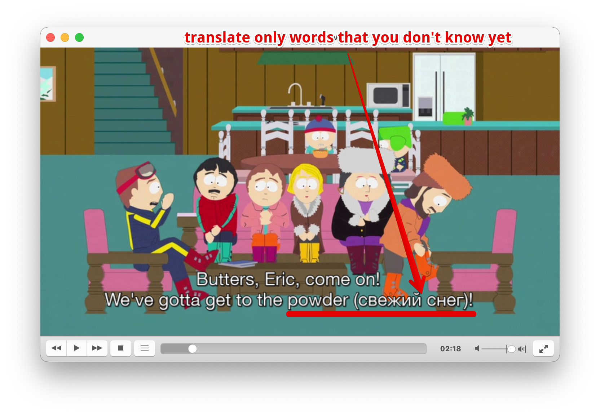
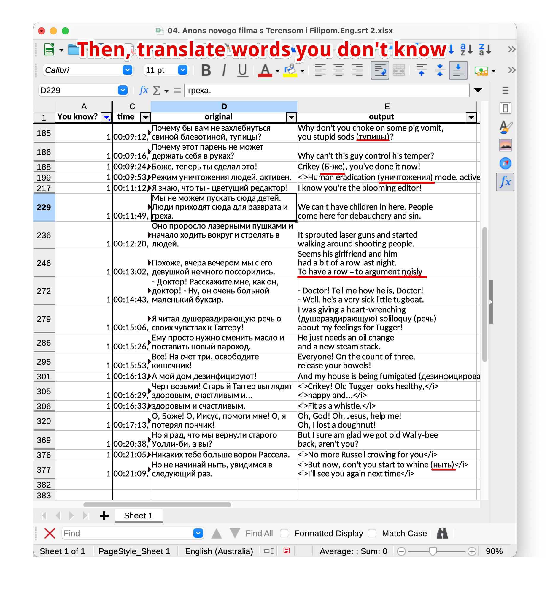

# Sublesee: SUbtitles LEvel C



Sublesee is a quite straightforward tool for a 
_particular_ subtitles translation. It helps you to 
translate only some words and sentences in a 
srt-file. 

Real-life usage example: you're studying English 
and advanced to B2/C1. Thus, you already know a lot 
of words, so watching with non-English subtitles 
doesn't help much. But while you're watching with 
English subtitles, sometimes you bump into the 
words you can't understand. But you don't pause the 
video and don't translate, because you're watching 
your favorite TV-show with your girlfriend. Or just 
cause you're lazy. **Sublesee** wants to help you to 
achieve this.


# Installation

```bash
pip install git+https://github.com/egslava/sublesee.git#subdirectory=soft
```

# Usage — a bird's eye view

1. Convert srt to xlsx and open in spreadsheets:
```bash
sublesee srt2xlsx path-to.srt
```

2. Modify "output" column


3. Convert xlsx into a new srt-file

```bash
sublesee xlsx2srt path-to.xlsx
```
